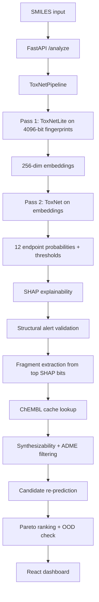

# ToxNet Prescription Engine

End-to-end molecular toxicity research platform for the Tox21 benchmark.

This repository is not just a classifier. It is a prediction-to-prescription system that:

1. Predicts toxicity across all 12 Tox21 endpoints.
2. Explains which molecular fragment is likely responsible using SHAP plus structural alert validation.
3. Suggests synthesizable bioisostere replacements backed by local ChEMBL cache lookup.
4. Re-scores every candidate across all endpoints and ranks the results with Pareto dominance.
5. Surfaces calibrated uncertainty, OOD proximity, and a chemist-facing dashboard.

## Project Snapshot

- Backend: FastAPI + PyTorch + RDKit
- Frontend: React + TypeScript + Vite + Tailwind
- Training: Two-pass bootstrap training with OPTUNA and focal loss
- Explainability: SHAP expected gradients
- Candidate generation: ChEMBL cache + synthesizability + ADME filtering
- Research notes: roadmap, literature synthesis, and decision logs live in `Documents/`

## Why This Project Exists

The goal is to support a chemist or medicinal chemist with a practical workflow:

- identify risky Tox21 endpoints,
- point to the likely toxic fragment,
- propose safer bioisosteres,
- and explain which proposed change is most defensible.

The dashboard is designed to show the output in a format that is closer to a medicinal chemistry report than a plain ML prediction table.

## Architecture

### High-Level Flow



### Two-Pass Training Strategy

The model is trained in two stages:

- Pass 1: `ToxNetLite` learns from raw 4096-bit Morgan fingerprints and produces continuous embeddings.
- Pass 2: `ToxNet` is trained on the 256-dim embeddings, including augmentation in embedding space for SMOTE-valid endpoints.

This is implemented in `Project_Implementation/src/train.py` and loaded for inference through `Project_Implementation/src/explain.py`.

### Inference Pipeline

The inference stack performs the following steps:

1. Validate the SMILES string.
2. Predict all 12 toxicity endpoints.
3. Compute SHAP on the full two-pass pipeline.
4. Cross-check the input against PAINS and Brenk structural alerts.
5. Map the top toxic fingerprint bits back to fragments.
6. Query the local ChEMBL cache for replacement candidates.
7. Filter candidates by synthesizability and ADME preservation.
8. Re-predict candidates and rank them by Pareto dominance.

## Repository Layout

```text
pds10/
|-- Documents/                    Research notes, roadmap, literature synthesis
|   |-- literature_grounded_spec.md
|   |-- tox21_roadmap.md.resolved
|   |-- extracted_papers.txt
|   |-- Antigravity_chat.md
|   `-- ...
|-- Project_Implementation/       Main runnable project
|   |-- data/
|   |   |-- raw/
|   |   |   `-- tox21.csv
|   |   `-- processed/
|   |       |-- tox21_cleaned.csv
|   |       |-- cohesion_table.csv
|   |       |-- failed_smiles_log.csv
|   |       `-- splits/
|   |-- frontend/
|   |   |-- src/
|   |   |   |-- App.tsx
|   |   |   |-- App.css
|   |   |   |-- index.css
|   |   |   `-- main.tsx
|   |   |-- package.json
|   |   `-- vite.config.ts
|   |-- models/
|   |   |-- model_artifact.pkl
|   |   |-- toxnet_lite.pt
|   |   `-- toxnet_final.pt
|   |-- notebooks/
|   |   |-- 01_data_cleaning.ipynb
|   |   |-- 02_Featurization_and_Split.ipynb
|   |   |-- 03_Geometric_Imbalance.ipynb
|   |   |-- 04_Training.ipynb
|   |   `-- 05_Explainability.ipynb
|   |-- scripts/
|   |   |-- build_chembl_cache.py
|   |   |-- check_generalization.py
|   |   |-- test_pareto.py
|   |   `-- test_pipeline.py
|   |-- scscore/                  Local submodule used for SCScore
|   |-- src/
|   |   |-- api.py
|   |   |-- train.py
|   |   |-- model.py
|   |   |-- explain.py
|   |   |-- prescription_pipeline.py
|   |   |-- bioisostere.py
|   |   |-- pareto.py
|   |   |-- dataset.py
|   |   |-- featurize.py
|   |   |-- focal_loss.py
|   |   |-- geometric_imbalance.py
|   |   `-- scaffold_split.py
|   |-- docker-compose.yml
|   |-- Dockerfile
|   |-- requirements.txt
|   `-- api_logs.txt
`-- README.md                     This file
```

## Important Files and What They Do

### Backend and model code

- `Project_Implementation/src/api.py` - FastAPI entrypoint, loads the trained artifact, training fingerprints, and ChEMBL cache.
- `Project_Implementation/src/train.py` - Two-pass training, OPTUNA search, embedding extraction, and final model fitting.
- `Project_Implementation/src/model.py` - `ToxNetLite` and `ToxNet` definitions.
- `Project_Implementation/src/explain.py` - Pipeline wrapper, threshold calibration, and SHAP support.
- `Project_Implementation/src/prescription_pipeline.py` - Full inference workflow from SMILES to ranked candidate suggestions.
- `Project_Implementation/src/bioisostere.py` - Fragment extraction, synthesizability scoring, ADME checks, and ChEMBL cache helpers.
- `Project_Implementation/src/pareto.py` - Candidate scoring, OOD similarity, and Pareto ranking.

### Frontend

- `Project_Implementation/frontend/src/App.tsx` - Chemist-facing dashboard and report layout.
- `Project_Implementation/frontend/src/index.css` - Global visual styling and background treatment.
- `Project_Implementation/frontend/package.json` - Frontend scripts and dependencies.

### Research notebooks

- `01_data_cleaning.ipynb` - raw Tox21 cleanup and label handling.
- `02_Featurization_and_Split.ipynb` - fingerprint generation and scaffold split.
- `03_Geometric_Imbalance.ipynb` - cohesion analysis and SMOTE validity.
- `04_Training.ipynb` - two-pass training and OPTUNA.
- `05_Explainability.ipynb` - SHAP and interpretability.

### Utility scripts

- `scripts/build_chembl_cache.py` - builds the local cache used for bioisostere lookup.
- `scripts/test_pipeline.py` - runs the full prescription pipeline end to end.
- `scripts/check_generalization.py` - checks how the model behaves on molecules outside the training set.
- `scripts/test_pareto.py` - Pareto-ranking checks.

## Data and Artifacts

### Input data

- `Project_Implementation/data/raw/tox21.csv` - raw Tox21 dataset.
- `Project_Implementation/data/processed/tox21_cleaned.csv` - cleaned and standardized data.
- `Project_Implementation/data/processed/splits/` - train / validation / test arrays and split metadata.

### Model outputs

- `Project_Implementation/models/model_artifact.pkl` - full inference bundle.
- `Project_Implementation/models/toxnet_lite.pt` - Pass 1 weights.
- `Project_Implementation/models/toxnet_final.pt` - Pass 2 weights.

### Cache and logs

- `Project_Implementation/data/chembl_cache.pkl` - local ChEMBL fragment cache used by the prescription pipeline.
- `Project_Implementation/api_logs.txt` - API log output.

## Requirements

### Core stack

- Python 3.10+ recommended
- PyTorch 2.7 + CUDA 12.8 if you are using the provided Docker image
- RDKit
- FastAPI
- SHAP
- Optuna
- scikit-learn
- imbalanced-learn
- ChEMBL web resource client
- SYBA / SCScore related dependencies

### Frontend stack

- Node.js 18+ recommended
- Vite
- React 19
- TypeScript
- Tailwind CSS

## Recommended Way to Run

### Option 1 - Docker (recommended)

The provided container is the easiest way to reproduce the full stack because it bundles RDKit, PyTorch, FastAPI, JupyterLab, and the chemistry dependencies.

```bash
cd Project_Implementation
docker compose up --build
```

This starts:

- API on `http://localhost:8000`
- JupyterLab on `http://localhost:8888`

The compose file is GPU-aware and expects NVIDIA runtime support if you want CUDA acceleration.

### Option 2 - Local backend + frontend

If you prefer to run without Docker, install the backend and frontend separately.

#### Backend

```powershell
cd Project_Implementation
python -m venv .venv
.\.venv\Scripts\Activate.ps1
pip install -r requirements.txt
python src/api.py
```

Notes:

- On Windows, RDKit is often easier through Conda than pure pip.
- If RDKit or PyTorch cause issues locally, use the Docker path above.

#### Frontend

```powershell
cd Project_Implementation/frontend
npm install
npm run dev
```

Frontend build check:

```powershell
npm run build
```

## Training Workflow

The standard training workflow is documented in `Project_Implementation/notebooks/04_Training.ipynb` and implemented in `Project_Implementation/src/train.py`.

High-level steps:

1. Load cleaned Tox21 data and split indices.
2. Run OPTUNA over the two-pass pipeline.
3. Train `ToxNetLite` on raw fingerprints.
4. Extract embeddings.
5. Apply ADASYN in embedding space for SMOTE-valid endpoints.
6. Train `ToxNet` on the augmented embeddings.
7. Save the final artifact bundle.

## One-Time Cache Build

Before running the prescription pipeline for the first time, build the local ChEMBL cache.

```bash
cd Project_Implementation
python scripts/build_chembl_cache.py
```

Important:

- The scripts were authored around the Docker path `/workspace`, so they are most reliable inside the container.
- If you run them locally, adjust the hardcoded paths or run them through the container.

## API

### `GET /`

Returns a simple health response.

### `POST /analyze`

Request body:

```json
{
  "smiles": "Nc1ccccc1",
  "top_shap_bits": 3,
  "max_candidates": 15
}
```

The response typically includes:

- `prediction` - probabilities, flags, mean probability, and flagged endpoint count
- `alerts` - PAINS/Brenk hits and SHAP confidence
- `shap_fragments` - top fragment evidence
- `primary_toxic_fragment` - top toxic motif
- `pareto_candidates` - ranked bioisostere suggestions
- `pipeline_status` - pipeline outcome

### Example request

```bash
curl -X POST http://localhost:8000/analyze \
  -H "Content-Type: application/json" \
  -d "{\"smiles\":\"Nc1ccccc1\"}"
```

## Generalization and Validation

Useful scripts for research validation:

- `python scripts/test_pipeline.py` - end-to-end pipeline smoke test.
- `python scripts/check_generalization.py` - checks behavior on molecules with known literature expectations.
- `python scripts/test_pareto.py` - verifies ranking behavior.

## Research Notes and Documentation

The `Documents/` folder contains the design and research trail for the project, including:

- roadmap and project architecture notes,
- literature synthesis,
- imbalance and correction strategy,
- extracted paper notes,
- and decision logs.

If you are using this repo as a research reference, start with:

1. `Documents/tox21_roadmap.md.resolved`
2. `Documents/literature_grounded_spec.md`
3. `Project_Implementation/notebooks/04_Training.ipynb`
4. `Project_Implementation/src/prescription_pipeline.py`

## Development Commands

### Backend

```bash
python src/api.py
```

### Frontend

```bash
cd frontend
npm run dev
npm run build
npm run lint
```

### Docker

```bash
docker compose up --build
```

## Model Interpretation

The dashboard and API are designed to answer these questions:

- Which endpoints are likely toxic?
- Which fragment is driving the signal?
- Is the attribution supported by structural alerts?
- What candidate replacement improves the toxic endpoints without breaking synthesis or ADME?
- How confident is the model on known chemical space?

## Output Interpretation

The most useful fields for chemist review are:

- `prediction.n_flagged` - how many of the 12 endpoints are flagged
- `alerts.shap_confidence` - whether SHAP attribution is structurally plausible
- `primary_toxic_fragment` - the likely problematic motif
- `pareto_candidates[0]` - the best-ranked replacement candidate
- `pareto_candidates[0].ood_max_sim` - training-set proximity / coverage indicator

## Notes and Caveats

- The project uses a local `scscore/` submodule.
- Some helper scripts assume Docker paths such as `/workspace`.
- The current app is already wired for the trained `model_artifact.pkl` bundle.
- This is a research support tool, not a clinical decision system.

## Suggested Citation / Credit

If you refer to this repository in a project or report, describe it as a two-pass Tox21 molecular toxicity prediction and prescription system built around:

- `ToxNetLite` for embedding learning,
- `ToxNet` for final toxicity prediction,
- SHAP + structural alerts for explanation,
- and Pareto-ranked bioisostere replacement for actionability.
